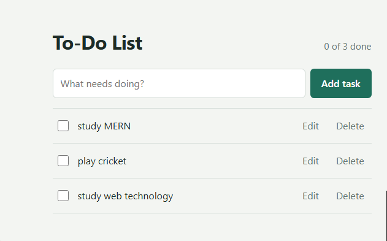
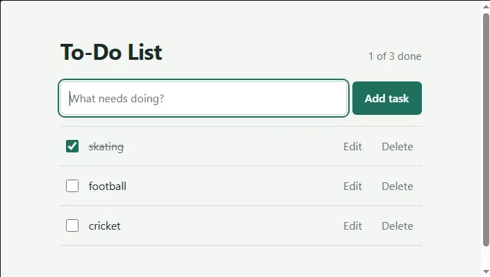
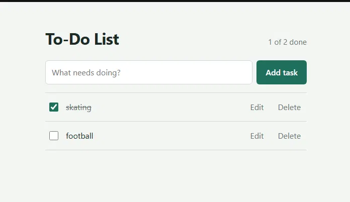
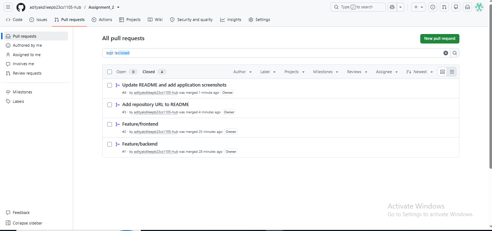

# MERN To-Do List

A full-stack To-Do List built with **MongoDB, Express.js, React (Vite) and Node.js**.
Tasks are stored in MongoDB and managed through a REST API - add, view, edit, complete and delete, all without a page reload.

**GitHub repository:** <paste your repository URL here>

## Project structure

```
.
├── backend/               Express + Mongoose API
│   ├── models/Task.js     Task schema (title, completed, createdAt)
│   ├── routes/tasks.js    GET / POST / PUT / DELETE routes
│   ├── server.js          App entry, CORS, MongoDB connection
│   └── .env.example
├── frontend/              React app (Vite)
│   └── src/
│       ├── api.js         fetch calls to the backend
│       ├── App.jsx        state + handlers
│       └── components/    TaskForm, TaskList, TaskItem
└── docs/screenshots/      application and pull request screenshots
```

## Prerequisites
- Node.js 18+
- MongoDB running locally, **or** a free MongoDB Atlas cluster

## Run the backend
```bash
cd backend
npm install
cp .env.example .env      # then fill in the values below
npm start                 # http://localhost:5000
```

`backend/.env`:
| Variable | Example | Meaning |
|---|---|---|
| `MONGO_URI` | `mongodb://127.0.0.1:27017/todo-app` or your Atlas string | MongoDB connection string |
| `PORT` | `5000` | Port for the API |
| `CLIENT_ORIGIN` | `http://localhost:3000` | The only origin allowed by CORS |

## Run the frontend
In a second terminal:
```bash
cd frontend
npm install
npm start                 # http://localhost:3000
```
Optional: set `VITE_API_URL` in `frontend/.env` if the API is not at `http://localhost:5000`.

## API reference
| Method | Endpoint | Body | Success | Errors |
|---|---|---|---|---|
| GET | `/api/tasks` | - | 200 + array of tasks | 500 |
| POST | `/api/tasks` | `{ "title": "..." }` | 201 + created task | 400 empty title |
| PUT | `/api/tasks/:id` | `{ "title"?, "completed"? }` | 200 + updated task | 400 invalid/empty, 404 not found |
| DELETE | `/api/tasks/:id` | - | 200 | 404 not found |

Titles are converted with `String()`, trimmed, and rejected with `400` if empty.

## Quick API test
```bash
curl -X POST http://localhost:5000/api/tasks -H "Content-Type: application/json" -d '{"title":"Test task"}'
curl http://localhost:5000/api/tasks
```

## Screenshots
Add your screenshots to `docs/screenshots/` and reference them here:






## Git workflow
- `feature/backend` and `feature/frontend` branches, each merged into `main` through a pull request.
- `.env` and `node_modules` are git-ignored; `.env.example` lists the required variables.
